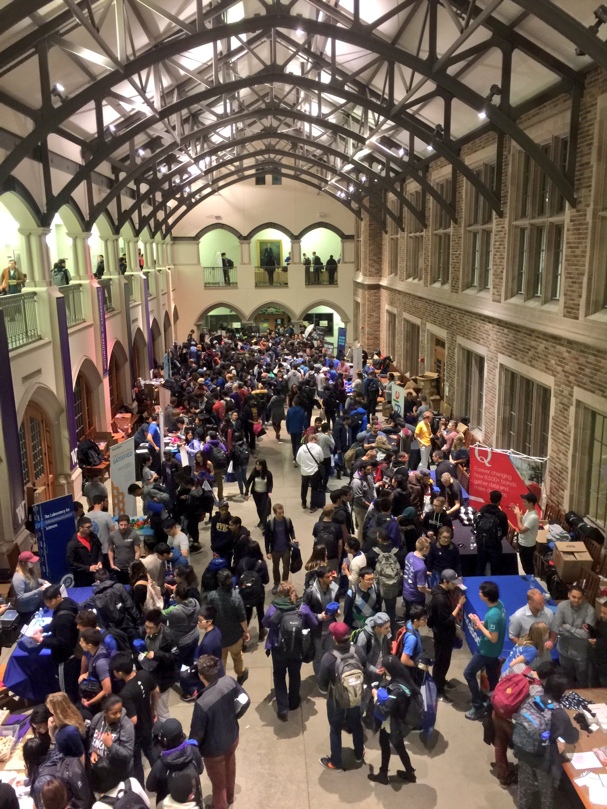
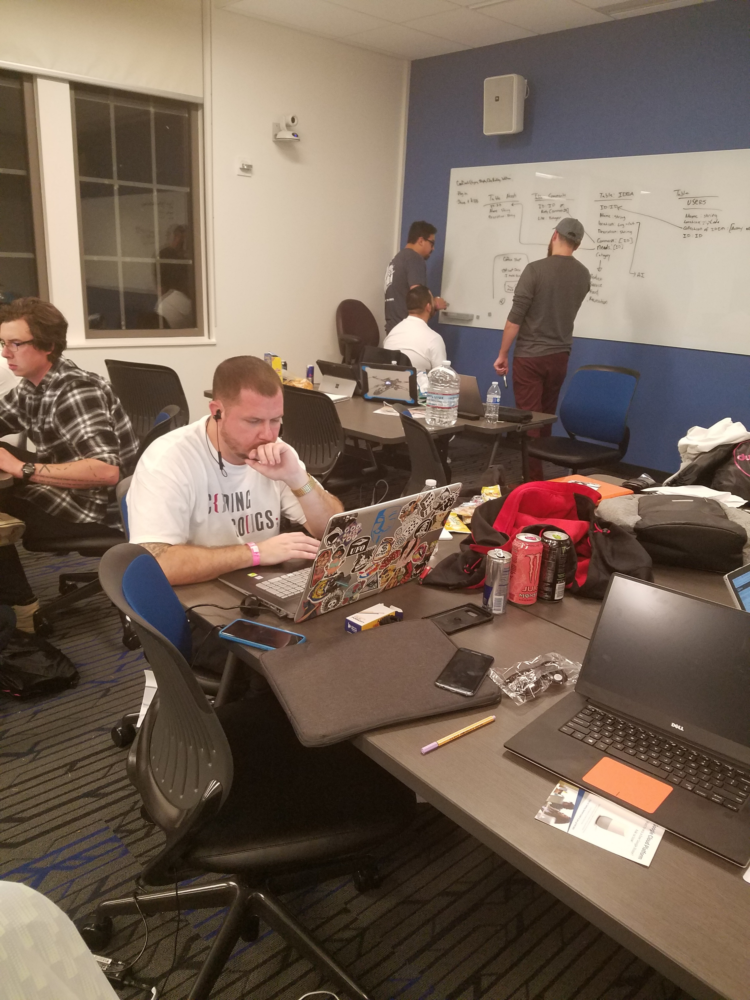
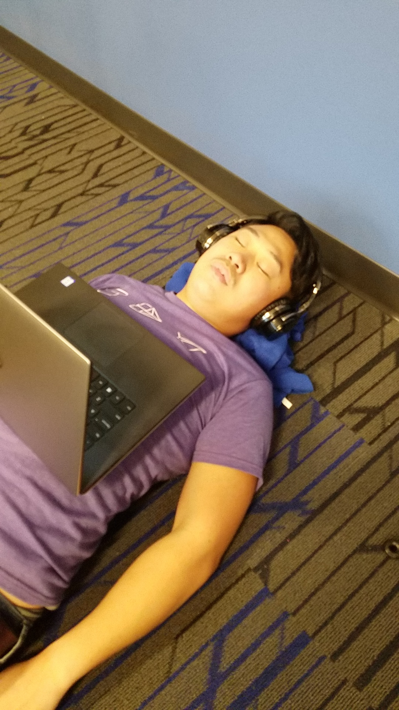

<!--- .slide: data-background-video="./docs/assets/techback.mp4" -->
# Coding Cougs

---
## Introduction
* President - Jiro Farah
* Vice President - Haiden Deaton
* Treasurer - Ryan Joyce
* Secretary - Randy Tran

---
# Purpose
* To foster a culture of learning within the Computer Science community of the Tri-Cities.
* An environment to explore new skills.
* Participate in small and large scale coding projects.
* Encourage members to seek out opportunities that will expand their knowledge.

---

## Previous Hackathon - [dubhacks](http://dubhacks.co/)

## What is a Hackathon?

"Anyone who has an interest in technology attends a hackathon to learn, build & share their creations" (MLH)

---
## Why Hackathon
#### Hackathons...
* are an innovative proving ground for new ideas.
* build a bridge to the developer community.
* introduce people to new and inovative technologies.
* provide real life experience in software development.
* promote networking with companies.

---
## Previous Hackathon
#### First Hack

---
## Previous Hackathon
#### [dubhacks](http://dubhacks.co/)

---
# [Crimson Code](http://hackathon.eecs.wsu.edu/)

---
## Budget
### The Total requested amount is $2500.

    Description   | Quantity      | Total
    ------------- | ------------- | ---------
    Hotel         | 6 Rooms       |  $850
    Cars          | 2 Vans        |  $410
    Gas           | 2             |  $200
    T-Shirts      | 30            |  $650
    Food          | 12            |  $250
    ------------- | ------------- | ---------
                  |               |  $2360

----
## Hotel Rooms
### Staying at The [Hilltop](https://hilltopinnpullman.com/) near WSU Pullman
* Requesting 6 rooms
    *  2 members per room

    

        12 club members
    

Jiro, Haiden, Ryan J., Randy, Stephanie, Ryan B., William, Mike, Bobby, Cole, Manny, Devon

----
## Hotel Rooms - Cost
* Room Cost: $109.95 per room
* Total cost w/ tax: ~ $850

----
## Transportation
### We are renting from Enterprise
* Requesting two 7-passenger vans
    * For 3 days (Fri, Sat, Sun)
    * Night drop off
* Drivers will be club officers
    * Jiro, Haiden, Ryan, and Randy

----
## Transportation - Cost
* Rental Cost: $205.41 per van
    * Total cost of rental: ~ $410.00
* 3-Day Trip Gas Cost: $100 per van
    * Total cost of gas: ~ $200.00
* Total cost: ~ $610.00

----
## T-Shirts
### Club wants to get new T-shirts
* T-shirts are made locally through
    - __Team Henry Designs__
* Requesting 30 t-shirts
* T-shirt Cost: ~ $20 per t-shirt
* Total cost w/ tax: ~ $651.60

----
## Food
* Crimson Code is providing meals for Saturday and Sunday at no additional cost
* Requesting funds to provide dinner for Friday evening
* Meal Cost: ~ $20 per member
* Total cost: ~ $250

---
# Questions ?

---